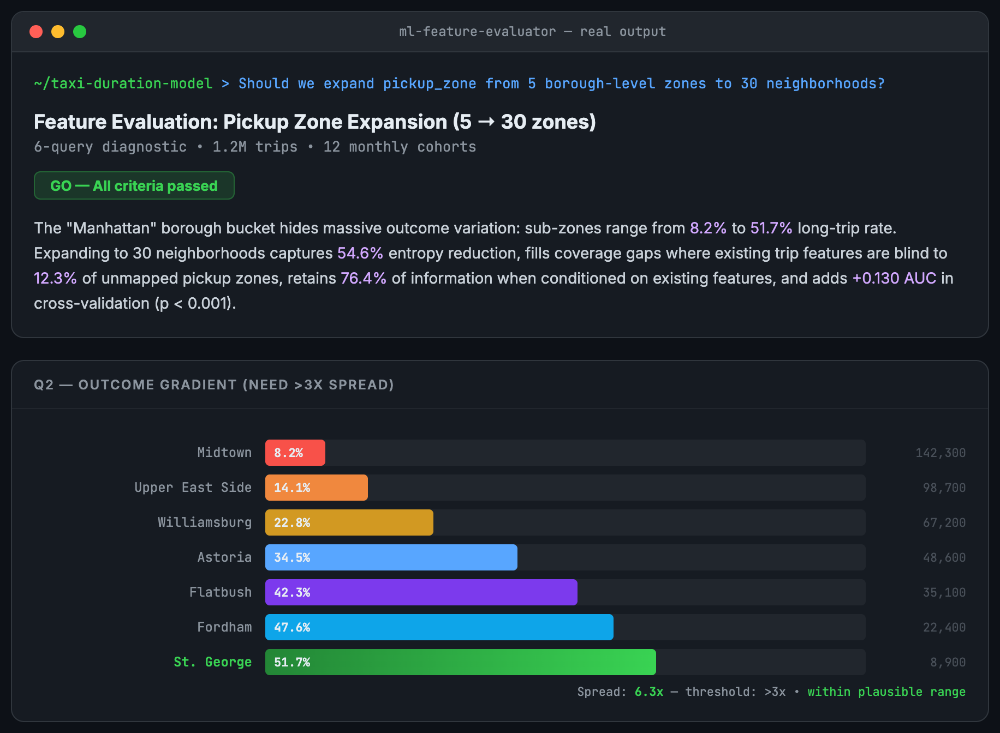
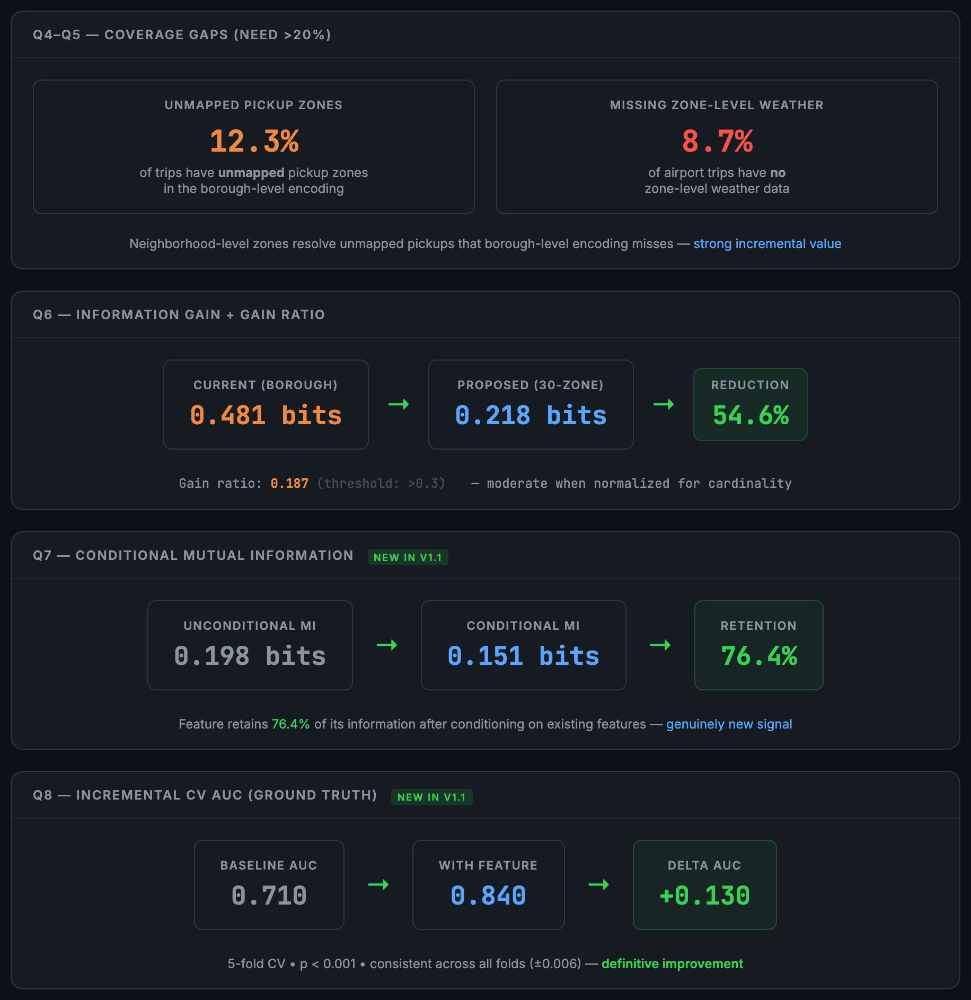
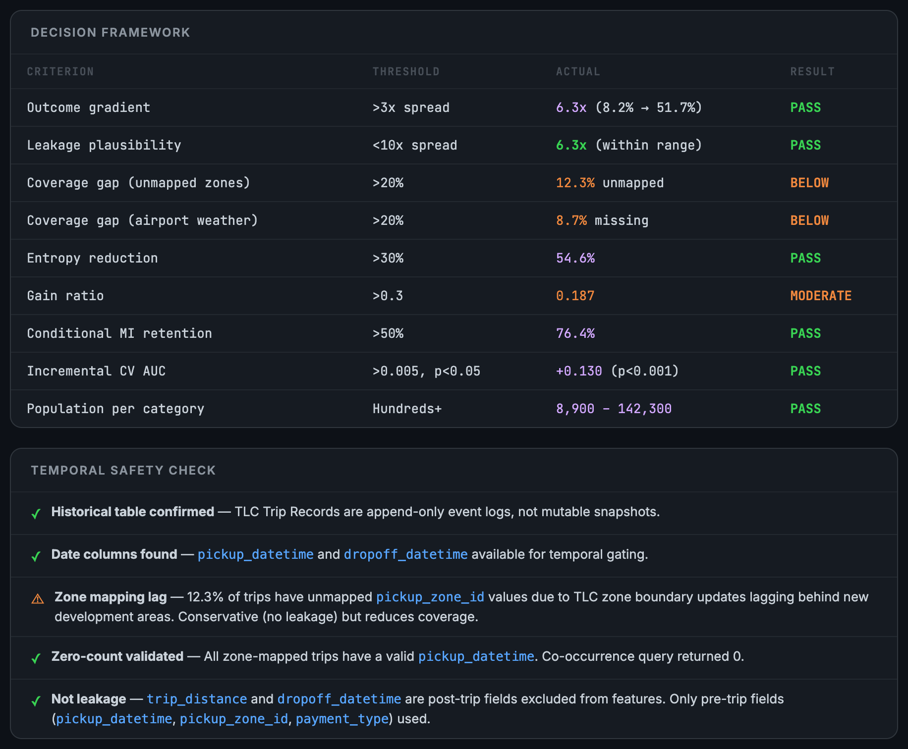

# ML Feature Evaluator

A [Claude Code](https://claude.com/claude-code) skill that answers "should we add this feature to the model?" with a structured, evidence-backed diagnostic — before you spend a week integrating something that adds no predictive value.


*Example: evaluating pickup zone expansion (5 boroughs to 30 neighborhoods) in an NYC taxi trip duration model. 10-step diagnostic with outcome gradient, coverage gaps, and GO verdict.*

<details>
<summary>See Q6-Q8 diagnostics, decision framework, and temporal safety check</summary>



*Gain ratio normalization (Q6), conditional mutual information showing 76.4% retention (Q7), and incremental CV AUC showing +0.130 improvement with p < 0.001 (Q8).*



*9-criterion decision framework with leakage plausibility flag, plus 9-point temporal safety checklist.*
</details>

## The Problem

You find a new data source. Someone says "we should add this to the model." What usually happens:

1. **Wasted effort.** You integrate it, spend a week on SQL/preprocessing/testing, and it adds 0.002 AUC.
2. **Missed opportunity.** You eyeball it, say "probably not worth it," and skip a transformative feature.
3. **Redundancy blind spot.** It looks great in isolation, but existing features already capture 90% of the signal.

This skill replaces gut feel with a 10-step diagnostic that takes 15-20 minutes (once your data is accessible) and gives you a clear go/no-go.

## How It Works

```
Q0  Data Quality Pre-Check   → NULL rate, cardinality, distribution — fail fast on bad data
Q1  Raw Distribution         → What's actually in the data?
Q2  Outcome Gradient         → Does it create different outcome rates? (need >3x spread)
    + Leakage Ceiling         → Is the gradient suspiciously strong? (flag >10x)
Q3  Bucket Decomposition     → How much info is hidden in the current lumped bucket?
Q4  Coverage Gap (Signal A)  → Does the new source see things existing features miss?
Q5  Coverage Gap (Signal B)  → Same check for a second signal
Q6  Entropy + Gain Ratio     → How much does the split help, normalized for cardinality?
Q7  Conditional MI           → Does it add info BEYOND what existing features capture?
Q8  Incremental CV AUC       → Ground truth: does the model actually improve? (p-value)
    ─────────────────────
    Temporal Safety (9-point) → Snapshot detection, proxy leakage, preprocessing leakage
    Decision Framework        → Go / no-go with 9 quantitative criteria
    Implementation Plan       → SQL, preprocessing, testing, rollback, monitoring spec
    Mandatory Review          → Fresh agent critiques the plan before you see it
```

Works with any SQL dialect (BigQuery, Postgres, Snowflake, Databricks) or pandas DataFrames.

## Quick Start

```
You: Should we expand pickup_zone from 5 boroughs to 30 neighborhoods?

Claude: Running 10-step feature diagnostic...
        Q0: Data quality — 2% NULL, 30 distinct zones ✓
        Q2: Outcome gradient — 8.2% → 51.7% across 30 zones (6.3x spread) ✓
        Q4: Coverage gap — 12.3% of trips have unmapped pickup zones ✓
        Q7: Conditional MI — 76.4% retained after conditioning ✓
        Q8: Incremental AUC — +0.130, p < 0.001 via DeLong test ✓
        Temporal safety — all 9 checks passed ✓

        VERDICT: GO — feature adds genuine new signal
```

## Installation

### Claude Code CLI (recommended)
```bash
claude install-skill github:wan-huiyan/ml-feature-evaluator
```

### Git Clone
```bash
git clone https://github.com/wan-huiyan/ml-feature-evaluator.git
cp -r ml-feature-evaluator/skills/ml-feature-evaluator ~/.claude/skills/
```

### Manual
Copy `SKILL.md` into `~/.claude/skills/ml-feature-evaluator/SKILL.md`

## Typical Ad-Hoc Analysis vs With Skill

| Typical Ad-Hoc | With Skill |
|----------------|------------|
| Correlation check + "looks useful" | "Outcome gradient: 8.2% → 51.7%, 54.6% entropy reduction, gain ratio 0.187" |
| Coverage check on the new source alone | "12.3% of trips have unmapped pickup zones in borough-level encoding — genuinely new signal" |
| No redundancy check against existing features | "76.4% of information retained after conditioning on existing features" |
| Train a model, eyeball AUC | "+0.130 AUC, p < 0.001 via DeLong test, consistent across all 5 folds" |
| Temporal safety as an afterthought | 9-point checklist: proxy leakage, preprocessing leakage, snapshot traps |
| Ad-hoc implementation | Plan with monitoring spec + mandatory fresh-agent review catching train/serve skew |

## Decision Criteria

Thresholds in **bold** are grounded in published sources. Thresholds in *italic* are practitioner heuristics — adjust based on your domain, sample size, and cost of errors.

| Criterion | Threshold | Source |
|-----------|-----------|--------|
| Outcome gradient | *>3x spread* | Heuristic |
| Leakage ceiling | *<10x spread* | Heuristic; cf. [Kaufman et al. (2012)](https://dl.acm.org/doi/10.1145/2382577.2382579) |
| Coverage gaps | *>20%* | Heuristic |
| Entropy reduction | *>30%* | Heuristic |
| Gain ratio | **Rank-based** (above-average info gain filter, then highest) | [Quinlan (1993)](https://link.springer.com/book/10.1007/BF00993309) |
| Conditional MI | **Rank-based** (JMI/CMIM scoring) | [Brown et al. (2012)](https://jmlr.org/papers/v13/brown12a.html) |
| Incremental AUC | **p<0.05** (DeLong or bootstrap) | [DeLong et al. (1988)](https://pubmed.ncbi.nlm.nih.gov/3203132/); [Demler et al. (2012)](https://pmc.ncbi.nlm.nih.gov/articles/PMC3684152/) |
| Population per category | **20-300** per leaf/category | [LightGBM docs](https://lightgbm.readthedocs.io/en/latest/Parameters-Tuning.html); [van der Ploeg et al. (2014)](https://link.springer.com/article/10.1186/1471-2288-14-137) |
| PSI (drift check) | **<0.10 / 0.10-0.25 / >0.25** | [Siddiqi (2006)](https://www.wiley.com/en-us/Credit+Risk+Scorecards-p-9780471754510); sample-size dependent per [Yurdakul (2018)](https://scholarworks.wmich.edu/dissertations/3208/) |
| Temporal safety | **All guards pass** | [Kapoor & Narayanan (2023)](https://www.cell.com/patterns/fulltext/S2666-3899(23)00159-9) |

## Temporal Safety

The most commonly missed failure mode in feature evaluation. The skill runs a 9-point checklist:

1. Snapshot vs historical table detection
2. Date column validation for temporal guards
3. "Last modified" vs "initial event" date disambiguation
4. NULL and future-date handling
5. **Leakage is relative to the label, not intermediate milestones** — the most commonly misdiagnosed issue
6. Zero-count co-occurrence validation
7. Observation-point vs journey-step framing
8. Proxy leakage via correlated features
9. Preprocessing leakage (train-time transformations leaking test info)

## Real Findings from Production Use

- **Coverage gap killed a feature** — a candidate data source covered only 27% of trips for a signal already captured at 100% by the primary source.
- **Entropy reduction was 54.6%** — zone expansion from 5 boroughs to 30 neighborhoods revealed massive outcome variation inside the "Manhattan" bucket. Clear go.
- **Temporal safety flagged zone mapping lag** — 12.3% of trips had unmapped pickup zones due to TLC boundary updates lagging behind new development areas.
- **Review agent found 3 files the plan missed** — implementation plan didn't update the serving script's preprocessing, which would have caused silent train/serve skew.

## Limitations

- **Binary classification focus.** Thresholds and methodology are designed for binary outcomes (AUC-based). Multi-class and regression targets are not currently supported.
- **Requires data access.** The skill generates SQL queries for your database — you need a working connection from Claude Code or data pre-loaded in DataFrames.
- **LLM-generated SQL.** Queries are generated by Claude and should be reviewed before running against production databases. Results may vary between runs.
- **Categorical features primarily.** The diagnostic is optimized for evaluating categorical feature expansions and new categorical data sources. Continuous features work but some steps (bucket decomposition, entropy) are less applicable.

<details>
<summary>Common Bugs the Skill Warns About</summary>

Patterns learned from production incidents:

- **Category name mismatch** — old model expects `"Status A"`, new code emits `"Status – Active"`, XGBoost silently produces wrong predictions
- **Schema declaration vs output SELECT drift** — SQL build fails at compile time
- **Dead code from temporal gating** — explicit code sets match nobody because the temporal guard nullified the status; the fallback does all the work
- **Sentinel conflation** — two different meanings of a sentinel value in the fallback path
- **COALESCE source priority** — coverage determines priority, not "behavioral > CRM"
</details>

## Usage

```
> Should we add this new field to the model?

> Evaluate whether this data source is worth integrating

> We have a new categorical feature — is it worth expanding from 4 to 8 categories?

> /ml-feature-evaluator
```

The skill auto-triggers when you discuss new features, field expansions, new data sources, coverage gaps, or ask "should we add X to the model?"

<details>
<summary>Research Foundations</summary>

### Papers

| Source | Contribution |
|--------|-------------|
| [Brown et al. (JMLR 2012)](https://jmlr.org/papers/v13/brown12a.html) — Conditional Likelihood Maximisation | Q7: Joint Mutual Information for evaluating features conditioned on existing features |
| [Kaufman, Rosset & Perlich (KDD 2012)](https://dl.acm.org/doi/10.1145/2382577.2382579) — Leakage in Data Mining | Q2: Leakage plausibility ceiling — "suspiciously high signal" detection |
| [Quinlan (1993)](https://link.springer.com/book/10.1007/BF00993309) — C4.5 | Q6: Gain ratio normalization to penalize high-cardinality expansions |
| [Kapoor & Narayanan (Patterns 2023)](https://www.cell.com/patterns/fulltext/S2666-3899(23)00159-9) — Leakage and the Reproducibility Crisis | Temporal safety: proxy leakage and preprocessing leakage types |
| [Breck et al. (MLSys 2019)](https://proceedings.mlsys.org/paper_files/paper/2019/hash/928f1160e52192e3e0017fb63ab65391-Abstract.html) — Data Validation for ML (Google TFDV) | Q0: Data quality pre-check, monitoring spec schema contracts |
| [Sculley et al. (NeurIPS 2015)](https://papers.neurips.cc/paper/5656-hidden-technical-debt-in-machine-learning-systems.pdf) — Hidden Technical Debt in ML | Decision framework: CACE principle, pipeline complexity considerations |

### Tools & Libraries

| Tool | Contribution |
|------|-------------|
| [mlxtend](https://github.com/rasbt/mlxtend) | Q8: Sequential feature selection with CV |
| [Evidently AI](https://github.com/evidentlyai/evidently) | Q0: Data quality profiling, drift detection |
| [boruta_py](https://github.com/scikit-learn-contrib/boruta_py) | Q8: Shadow feature statistical testing |
| [mrmr](https://github.com/smazzanti/mrmr) | Q7: Minimum Redundancy Maximum Relevance |

### Industry

| Source | Contribution |
|--------|-------------|
| [Uber — Model Excellence Scores (2024)](https://www.uber.com/blog/enhancing-the-quality-of-machine-learning-systems-at-scale/) | Monitoring spec: SLO-style feature health contracts |
| [Nubank — Train-Serve Skew Guide](https://building.nubank.com/dealing-with-train-serve-skew-in-real-time-ml-models-a-short-guide/) | Monitoring spec: feature freshness and cache staleness |

</details>

## Related Skills

- **[ml-training-window-assessor](https://github.com/wan-huiyan/ml-training-window-assessor)** — When the question is "can we extend the training window?" rather than "should we add feature X?" Covers drift-aware validation, purged temporal CV with embargo, and XGBoost NaN handling.
- **[agent-review-panel](https://github.com/wan-huiyan/agent-review-panel)** — Multi-agent adversarial review for high-stakes code and plan reviews.

## Version History

| Version | Changes |
|---------|---------|
| 1.1.0 | Research-grounded thresholds (Quinlan, Brown, DeLong, Siddiqi), provenance labeling, limitations section, review panel improvements |
| 1.0.0 | Initial release: 10-step diagnostic (Q0-Q8), temporal safety, decision framework, demo screenshots |

## License

MIT
